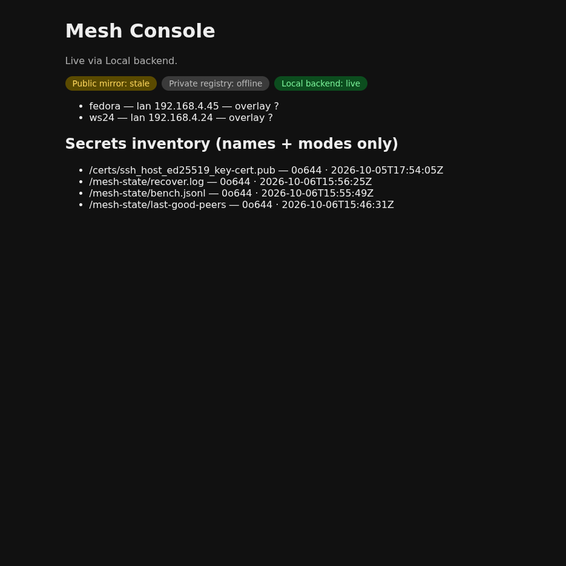
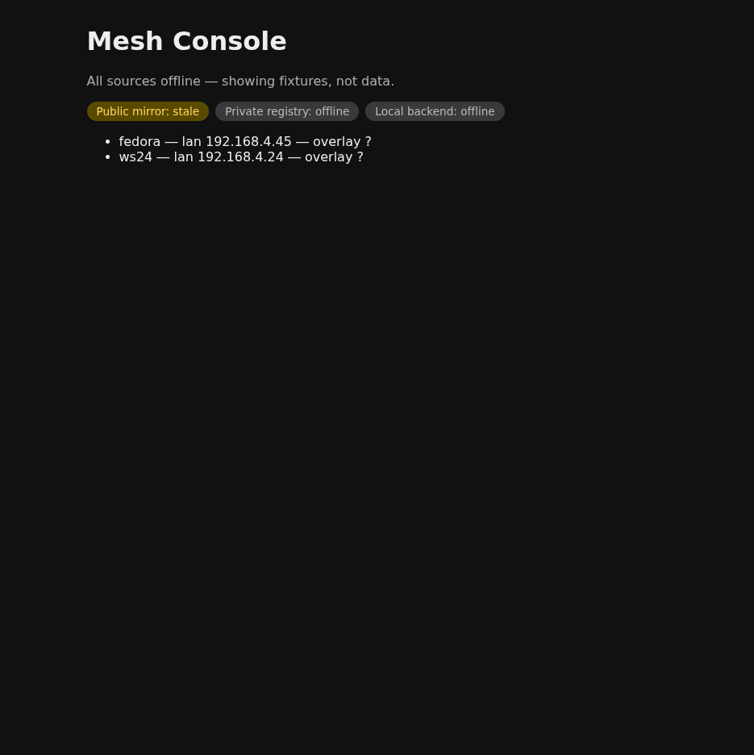

# Mesh Console user guide

Open the console: https://swipswaps.github.io/mesh-console/
(full detail locally: `docker compose up -d`, then serve `frontend/dist`
or `npm run dev` in `frontend/`).

## Reading badges

Each source reports `live`, `stale` (>10 min old data), or `offline`.
The subtitle names every live source — or says plainly that all are
offline. A `stale` mirror with fresh-looking nodes means: act on the
timestamps, not the rows.

## Nodes

Rows show `name — lan — overlay`; `?` means unknown, never guessed.
On the public page the overlay column stays `?` by design (stable
overlay IDs are not published).

## Security section

Names + modes + mtimes only — values never leave the host. It renders
only when the local backend is reachable; its absence on the public
page is the boundary working, not a bug.

## Sharing

Snapshots (Phase 2b): Share button → expiry picker (1h/1d/1w) →
copy link. A snapshot renders read-only under a dated banner.

## Troubleshooting

- Backend unreachable: `docker ps` (container `mesh-console-backend`),
  then `curl http://127.0.0.1:5180/health` (want `200`).
- Stale mirror: heartbeats stopped — check node PATs and the
  `mirror-registry` Actions runs.
- Login lost on refresh: by design (memory-only token).
- `/api/actions` returns 401: `MESH_CONSOLE_TOKEN` unset. Set it via
  `env_file` (mode 0600, gitignored), never CLI or chat.
